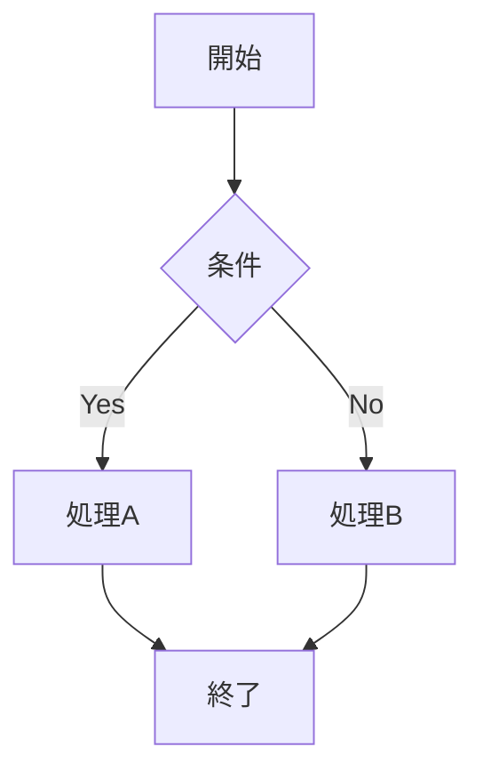

# Sli.dev プレゼンテーション管理

このリポジトリは[Sli.dev](https://sli.dev/)を使用したプレゼンテーションを効率的に管理するためのものです。  
**AIアシスタントがプレゼンテーションの内容・目的・対象者に応じて毎回最適な構成を考えることを前提**とした、シンプルで柔軟な構造になっています。

## ディレクトリ構造

```
slides/
├── README.md                        # このファイル
├── shared/                          # 共通リソース（必要に応じて使用）
│   ├── assets/                     # 共通画像・アイコン・ファイル
│   ├── components/                 # 再利用可能なVueコンポーネント
│   └── styles/                     # 共通CSSスタイル
└── presentations/                   # 実際のプレゼンテーション
    ├── YYYY-MM-topic/              # 日付-トピック形式
    │   ├── slides.md               # メインスライドファイル
    │   ├── package.json            # プロジェクト依存関係
    │   ├── components/             # プレゼンテーション固有のコンポーネント
    │   ├── public/                 # 静的アセット
    │   └── ...                     # その他必要なファイル
    └── ...
```

## AIとの協働によるスライド作成

### 基本的な流れ

1. **要件共有**: プレゼンテーションの目的、対象者、内容、時間をAIに伝える
2. **構成提案**: AIが最適な構成・デザイン・機能を提案
3. **スライド生成**: AIが内容に応じてカスタマイズされたスライドを作成
4. **反復改善**: フィードバックに基づいてAIが調整・改善

### AIアシスタントへの指示例

```
プレゼンテーション作成をお願いします。

【基本情報】
- タイトル: TypeScript入門
- 対象者: JavaScript経験者（TypeScript未経験）
- 時間: 45分
- 目的: TypeScriptの基本概念と実践的な使い方を習得

【内容要件】
- 基本的な型システムの説明
- 実用的なコード例を多く含める
- ハンズオン形式にしたい
- 質疑応答の時間を含む
```

## Sli.devの主要機能

### マークダウンベーススライド

```markdown
---
# スライド1
layout: default
---

# タイトルスライド

内容をここに記述

---

# スライド2

- 箇条書き
- **太字**や*斜体*も使用可能
```

### レイアウトバリエーション

```markdown
---
layout: center
class: text-center
---

# 中央寄せレイアウト

---
layout: image-right
image: /path/to/image.jpg
---

# 画像付きレイアウト

左側にテキスト、右側に画像を配置
```

### インタラクティブ要素

```markdown
# アニメーション効果

<div v-click="1">
最初にクリックで表示
</div>

<div v-click="2">
次にクリックで表示
</div>

<div v-after>
最後に自動表示
</div>
```

### コードハイライト

```markdown
# コード例

```typescript {2-4|6|all}
interface User {
  id: number        // ハイライト対象
  name: string      // ハイライト対象  
  email: string     // ハイライト対象
  
  isActive: boolean // 個別ハイライト
}
```

### 数式表示（KaTeX）

```markdown
# 数式の例

インライン: $E = mc^2$

ブロック:
$$
\sum_{i=1}^{n} x_i = x_1 + x_2 + \cdots + x_n
$$
```

### 図表（Mermaid）

```markdown
# フローチャート



## 命名規則とベストプラクティス

### ディレクトリ命名

```
presentations/YYYY-MM-topic/
```

**例:**
- `2024-06-typescript-intro` - TypeScript入門セッション
- `2024-07-team-retrospective` - チーム振り返り会
- `2024-08-product-launch` - プロダクトローンチ発表

### プロジェクト構成のベストプラクティス

1. **package.json**: 必要な依存関係のみを含める
2. **slides.md**: メインコンテンツファイル
3. **components/**: プレゼンテーション固有のVueコンポーネント
4. **public/**: 画像や動画などの静的アセット
5. **styles/**: カスタムCSS（必要に応じて）

### AIによる最適化のメリット

- **内容特化**: プレゼンテーションの内容に最適化された構成
- **対象者考慮**: 聴衆のレベルや業界に応じたトーンや説明レベル
- **目的最適化**: 教育、営業、報告など目的に応じた構成とデザイン
- **最新機能活用**: Sli.devの最新機能を適切に活用
- **創造性**: 固定テンプレートに縛られない自由な発想

## 開発ワークフロー

### 1. プレゼンテーション作成

```bash
# AIが作成したディレクトリに移動
cd presentations/2024-06-typescript-intro

# 依存関係をインストール
npm install

# 開発サーバー起動
npm run dev
```

### 2. ビルド・エクスポート

```bash
# 本番用ビルド
npm run build

# PDFエクスポート
npm run export

# その他の形式（設定により）
npm run export:png
npm run export:pptx
```

## 共通リソースの活用

### shared/assets/
- 会社ロゴ
- 共通アイコン
- 背景画像
- テンプレート画像

### shared/components/
- 会社情報コンポーネント
- 共通チャートコンポーネント
- カスタムレイアウト

### shared/styles/
- 会社ブランドカラー
- フォント設定
- 共通スタイル定義

## トラブルシューティング

### よくある問題

**Q: 開発サーバーが起動しない**
A: Node.jsバージョンを確認（推奨: 18以上）

**Q: 画像が表示されない**
A: `public/`ディレクトリに配置し、パスを確認

**Q: カスタムコンポーネントが認識されない**
A: `components/`ディレクトリの配置とファイル名を確認

**Q: 数式が表示されない**
A: KaTeX有効化の設定を確認

## 参考リンク

- [Sli.dev 公式ドキュメント](https://sli.dev/)
- [Sli.dev テーマ一覧](https://sli.dev/resources/theme-gallery)
- [Vue.js ドキュメント](https://ja.vuejs.org/)
- [Mermaid.js ドキュメント](https://mermaid.js.org/)
- [KaTeX 数式記法](https://katex.org/docs/supported.html)

---

**AIと協力して、毎回最適で創造的なプレゼンテーションを作成しましょう！ 🚀**