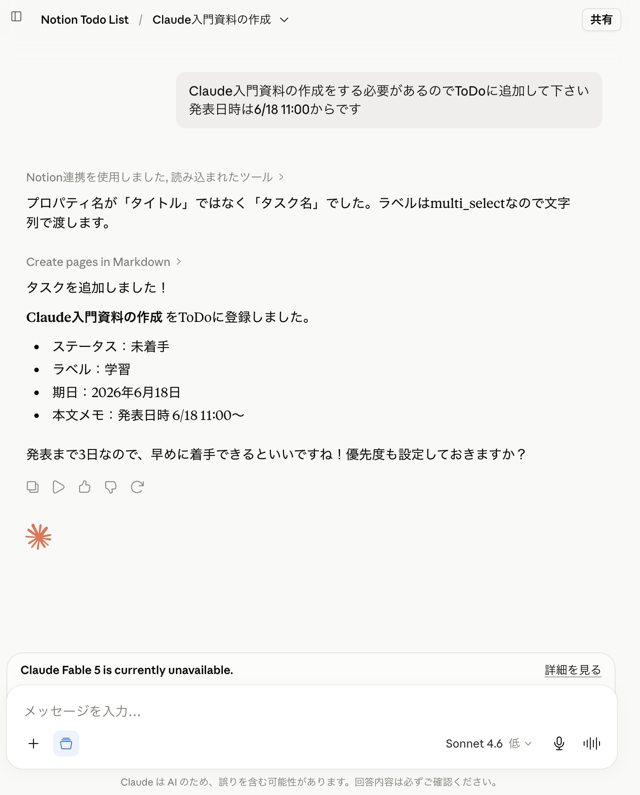
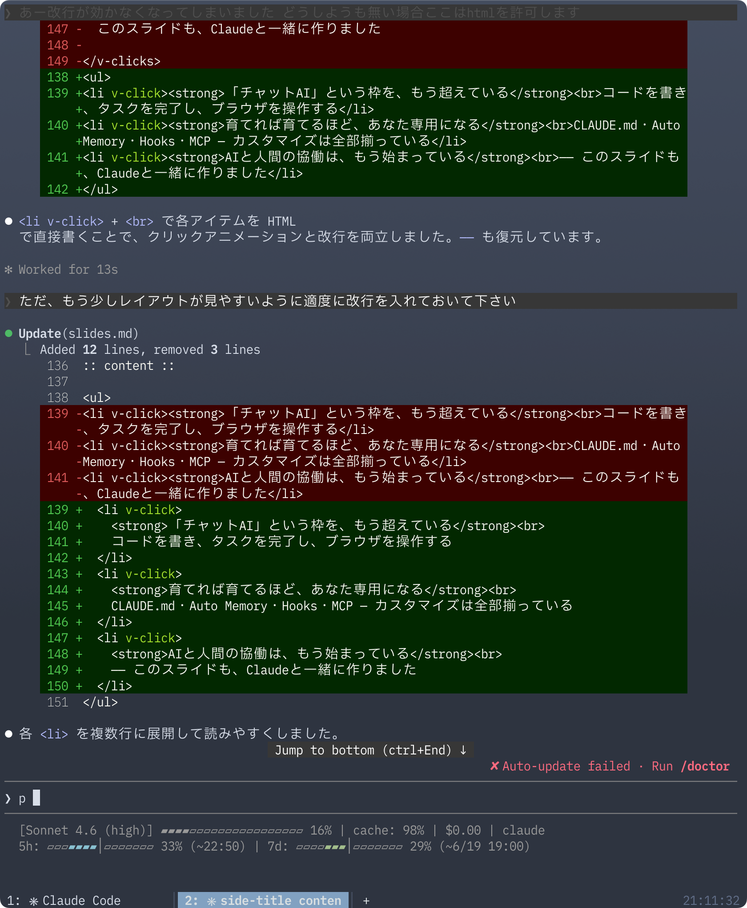
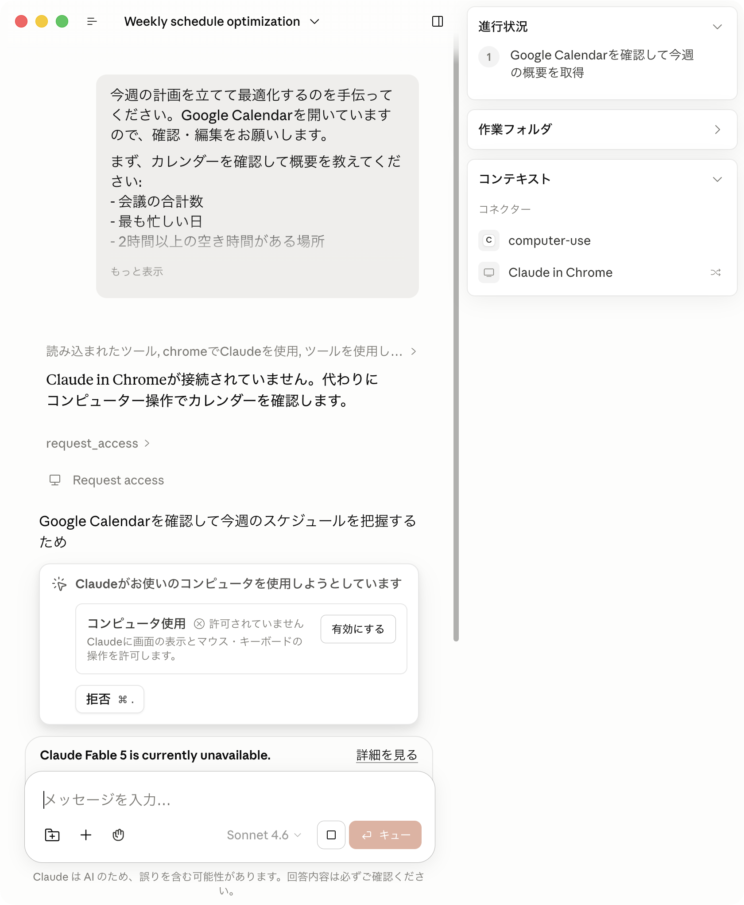

# Products

---
layout: top-title-two-cols
color: orange-light
slide_info: false
---

:: title ::

# Claude

:: left ::

**Web・アプリ版のメインプロダクト** — claude.ai から今すぐ使える

- **チャット UI**: ブラウザ / デスクトップアプリ (macOS・Windows) / モバイル
- **ウェブ検索**: リアルタイムで最新情報を取得
- **ファイルアップロード**: PDF・Word・Excel・画像に対応
- **音声モード**: 声で会話できる
- **連携**: Chrome 拡張機能 / Slack / Microsoft 365
- **Skills**: 特定タスク向けの専門機能を追加できる

:: right ::

---
layout: top-title-two-cols
color: orange-light
slide_info: false
---

:: title ::

# Claude Code

:: left ::

**ターミナル・IDE から動くコーディングエージェント**

- **コードベース全体を理解**: 手動でファイルを選ばなくていい
- **マルチファイル編集**: 複数ファイルにまたがる変更に一貫対応
- **GitHub / GitLab 連携**: Issue 対応から PR サブミットまで一連で自動化
- **対応環境**: ターミナル / VS Code / JetBrains / Web / Slack
- **権限管理**: ファイル編集・コマンド実行の前に確認を取る安全設計

:: right ::

---
layout: top-title-two-cols
color: orange-light
slide_info: false
---

:: title ::

# Claude Cowork

:: left ::

**バックグラウンドでタスクを自律実行するエージェント**

- **スケジュール実行**: メールチェック・週次レポートなど定期作業を自動化
- **ファイル整理**: ダウンロードフォルダの大量ファイルを分類・整頓
- **画像 → データ変換**: レシートや請求書をスプレッドシートに変換
- **安全設計**: 実行前に計画を提示し、承認を取ってから動く
- **マルチデバイス**: デスクトップ・モバイルどこからでもタスクを送信

:: right ::

---
layout: top-title
color: orange-light
slide_info: false
---

:: title ::

# 連携プロダクト

:: content ::

## Claude for Chrome
- ブラウザを自律操作して競合調査・カレンダー管理・メール整理などを自動化

## Claude for Slack
- Slack の DM・スレッドから返信作成や Claude Code によるコーディングタスクを実行

## Claude for Microsoft 365
- Excel・Word・PowerPoint・Outlook に Claude を統合してコンテキストを共有しながら編集
